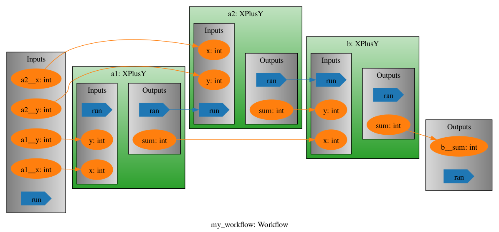

# pyiron_workflow


## Overview

This repository is home to the pyiron code for structuring workflows as graph objects, with different computational elements as nodes and data and execution signals travelling along edges. It is currently in an alpha state, changing quickly, and not yet feature-complete.

## The absolute basics

`pyiron_workflow` offers a single-point-of-entry in the form of the `Workflow` object, and uses decorators to make it easy to turn regular python functions into "nodes" that can be put in a computation graph:

```python
from pyiron_workflow import Workflow

@Workflow.wrap_as.function_node("sum")
def x_plus_y(x: int = 0, y: int = 0) -> int:
    return x + y

wf = Workflow("my_workflow")
wf.a1 = x_plus_y()
wf.a2 = x_plus_y()
wf.b = x_plus_y(x=wf.a1.outputs.sum, y=wf.a2.outputs.sum)

out = wf(a1__x=0, a1__y=1, a2__x=2, a2__y=3)
out.b__sum
>>> 6

wf.draw()
```

