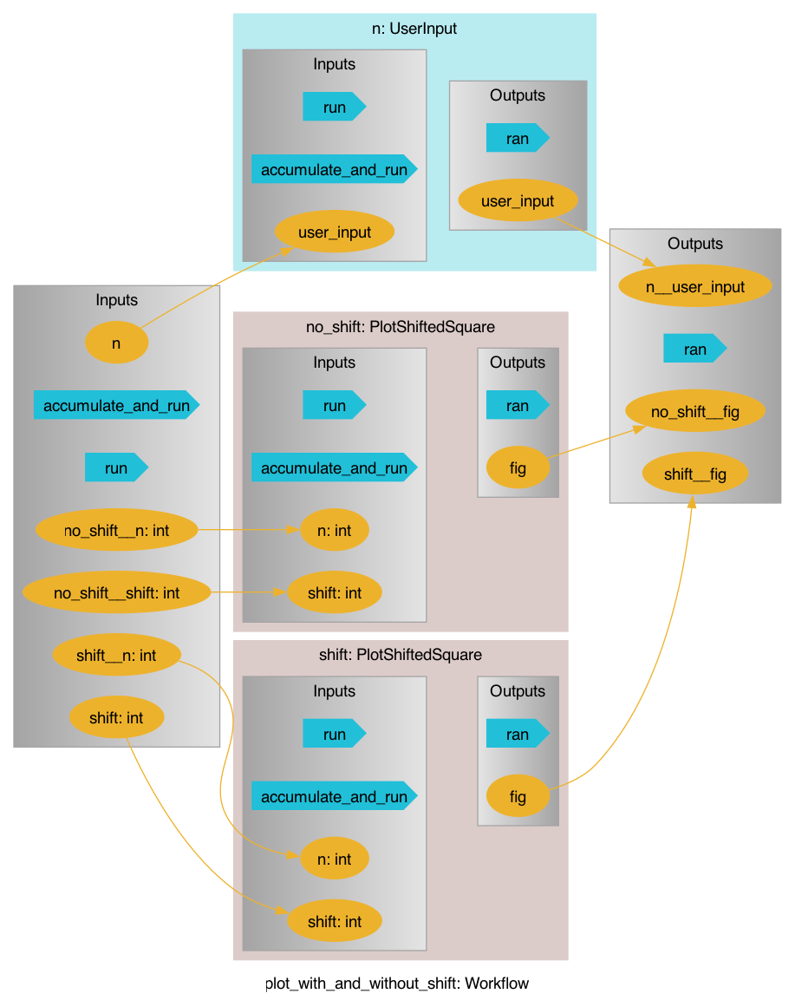

# pyiron_workflow

[](https://mybinder.org/v2/gh/pyiron/pyiron_workflow/HEAD)
[](https://opensource.org/licenses/BSD-3-Clause)
[](https://app.codacy.com/gh/pyiron/pyiron_workflow/dashboard?utm_source=gh&utm_medium=referral&utm_content=&utm_campaign=Badge_grade)
[](https://coveralls.io/github/pyiron/pyiron_workflow?branch=main)

[//]: # ([![Documentation Status]&#40;https://readthedocs.org/projects/pyiron-workflow/badge/?version=latest&#41;]&#40;https://pyiron-workflow.readthedocs.io/en/latest/?badge=latest&#41;)

[](https://anaconda.org/conda-forge/pyiron_workflow)
[](https://anaconda.org/conda-forge/pyiron_workflow)
[](https://anaconda.org/conda-forge/pyiron_workflow)
[](https://anaconda.org/conda-forge/pyiron_workflow)

## Overview

`pyiron_workflow` is a framework for constructing workflows as computational graphs from simple python functions. Its objective is to make it as easy as possible to create reliable, reusable, and sharable workflows, with a special focus on research workflows for HPC environments.

Nodes are formed from python functions with simple decorators, and the resulting nodes can have their data inputs and outputs connected. 

By allowing (but not demanding, in the case of data DAGs) users to specify the execution flow, both cyclic and acyclic graphs are supported. 

By scraping type hints from decorated functions, both new data values and new graph connections are (optionally) required to conform to hints, making workflows strongly typed.

Individual node computations can be shipped off to parallel processes for scalability. (This is an alpha-feature at time of writing and limited to single core parallel python processes; full support of [`pympipool`](https://github.com/pyiron/pympipool) is under active development)

Once you're happy with a workflow, it can be easily turned it into a macro for use in other workflows. This allows the clean construction of increasingly complex computation graphs by composing simpler graphs.

Nodes (including macros) can be stored in plain text, and registered by future workflows for easy access. This encourages and supports an ecosystem of useful nodes, so you don't need to re-invent the wheel. (This is an alpha-feature, with full support of [FAIR](https://en.wikipedia.org/wiki/FAIR_data) principles for node packages planned.)

## Example

`pyiron_workflow` offers a single-point-of-entry in the form of the `Workflow` object, and uses decorators to make it easy to turn regular python functions into "nodes" that can be put in a computation graph.

Nodes can be used by themselves and -- other than being "delayed" in that their computation needs to be requested after they're instantiated -- they feel an awful lot like the regular python functions they wrap:

```python
from pyiron_workflow import Workflow

@Workflow.wrap_as.single_value_node()
def add_one(x):
    return x + 1

add_one(add_one(add_one(x=0)))()
>>> 3
```

But the intent is to collect them together into a workflow and leverage existing nodes:

```python
from pyiron_workflow import Workflow

@Workflow.wrap_as.single_value_node()
def add_one(x):
    return x + 1

@Workflow.wrap_as.macro_node()
def add_three_macro(macro):
    macro.start = add_one()
    macro.middle = add_one(x=macro.start)
    macro.end = add_one(x=macro.middle)
    macro.inputs_map = {"start__x": "x"}
    macro.outputs_map = {"end__x + 1": "y"}

Workflow.register(
    "plotting", 
    "pyiron_workflow.node_library.plotting"
)

wf = Workflow("add_5_and_plot")
wf.add_one = add_one()
wf.add_three = add_three_macro(x=wf.add_one)
wf.plot = wf.create.plotting.Scatter(
    x=wf.add_one,
    y=wf.add_three.outputs.y
)

diagram = wf.draw()

import numpy as np
fig = wf(add_one__x=np.arange(5)).plot__fig
```

Which gives the workflow `diagram`



And the resulting `fig`


## Installation

`conda install -c conda-forge pyiron_workflow`

To unlock the associated node packages and ensure that the demo notebooks run, also make sure your conda environment has the packages listed in our [notebooks dependencies](.ci_support/environment-notebooks.yml)

## Learning more

Check out the demo [notebooks](notebooks), read through the docstrings, and don't be scared to raise an issue on this GitHub repo!