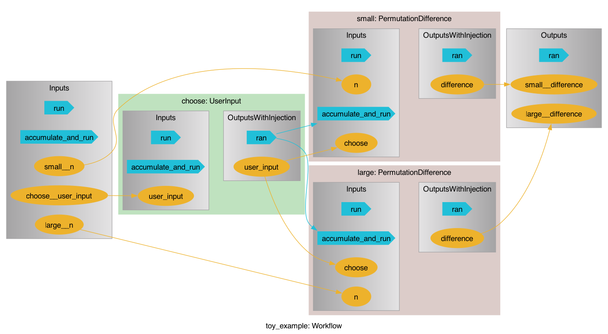
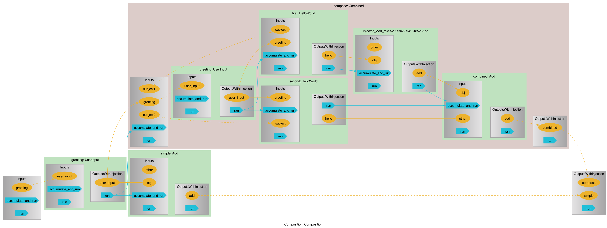

# pyiron_workflow

[](https://mybinder.org/v2/gh/pyiron/pyiron_workflow/HEAD)
[](https://opensource.org/licenses/BSD-3-Clause)
[](https://app.codacy.com/gh/pyiron/pyiron_workflow/dashboard?utm_source=gh&utm_medium=referral&utm_content=&utm_campaign=Badge_grade)
[](https://coveralls.io/github/pyiron/pyiron_workflow?branch=main)
[](https://pyiron-workflow.readthedocs.io/en/latest/?badge=latest)

[](https://anaconda.org/conda-forge/pyiron_workflow)
[](https://anaconda.org/conda-forge/pyiron_workflow)
[](https://anaconda.org/conda-forge/pyiron_workflow)
[](https://anaconda.org/conda-forge/pyiron_workflow)

## Overview

`pyiron_workflow` is a framework for constructing workflows as computational graphs from simple python functions. Its objective is to make it as easy as possible to create reliable, reusable, and sharable workflows, with a special focus on research workflows for HPC environments.

Nodes are formed from python functions with simple decorators, and the resulting nodes can have their data inputs and outputs connected. 

By allowing (but not demanding, in the case of data DAGs) users to specify the execution flow, both cyclic and acyclic graphs are supported. 

By scraping type hints from decorated functions, both new data values and new graph connections are (optionally) required to conform to hints, making workflows strongly typed.

Individual node computations can be shipped off to parallel processes for scalability. (This is a beta-feature at time of writing; the `Executor` executor from [`executorlib`](https://github.com/pyiron/exectorlib) is supported and tested; automated execution flows to not yet fully leverage the efficiency possible in parallel execution, and `executorlib`'s more powerful flux- and slurm- based executors have not been tested and may fail.)

Once you're happy with a workflow, it can be easily turned it into a macro for use in other workflows. This allows the clean construction of increasingly complex computation graphs by composing simpler graphs.

Nodes (including macros) can be stored in plain text as python code, and registered by future workflows for easy access. This encourages and supports an ecosystem of useful nodes, so you don't need to re-invent the wheel. (This is a beta-feature, with full support of [FAIR](https://en.wikipedia.org/wiki/FAIR_data) principles for node packages planned.)

Executed or partially-executed graphs can be stored to file, either by explicit call or automatically after running. When creating a new node(/macro/workflow), the working directory is automatically inspected for a save-file and the node will try to reload itself if one is found. (This is an alpha-feature, so it is currently only possible to save entire graphs at once and not individual nodes within a graph, all the child nodes in a saved graph must have been instantiated by `Workflow.create` (or equivalent, i.e. their code lives in a `.py` file that has been registered), and there are no safety rails to protect you from changing the node source code between saving and loading (which may cause errors/inconsistencies depending on the nature of the changes).) 

## Example

`pyiron_workflow` offers a single-point-of-entry in the form of the `Workflow` object, and uses decorators to make it easy to turn regular python functions into "nodes" that can be put in a computation graph.

Nodes can be used by themselves and -- other than being "delayed" in that their computation needs to be requested after they're instantiated -- they feel an awful lot like the regular python functions they wrap:

```python
>>> from pyiron_workflow import Workflow
>>>
>>> @Workflow.wrap.as_function_node("y")
... def AddOne(x):
...     return x + 1
>>>
>>> AddOne(AddOne(AddOne(x=0)))()
3

```

But the intent is to collect them together into a workflow and leverage existing nodes. We can directly perform (many but not quite all) python actions natively on output channels, can build up data graph topology by simply assigning values (to attributes or at instantiation), and can package things together into reusable macros with customizable IO interfaces:

```python
>>> import math
>>> 
>>> @Workflow.wrap.as_function_node("y")
... def AddOne(x):
...     return x + 1
>>> 
>>> @Workflow.wrap.as_function_node("permutations")
... def Permutations(n, choose=None):
...     return math.perm(n, choose)
>>> 
>>> @Workflow.wrap.as_macro_node()
... def PermutationDifference(self, n, choose=None):
...     self.p = Permutations(n, choose=choose)
...     self.plus_1 = AddOne(n)
...     self.p_plus_1 = Permutations(self.plus_1, choose=choose)
...     self.difference = self.p_plus_1 - self.p  
...     return self.difference
>>> 
>>> wf = Workflow("toy_example")
>>> 
>>> wf.choose = Workflow.create.standard.UserInput(2)
>>> wf.small = PermutationDifference(5, choose=wf.choose)
>>> wf.large = PermutationDifference(25, choose=wf.choose)
>>> 
>>> wf()
{'small__difference': 10, 'large__difference': 50}

```

Packaging as a workflow/macro makes it easy to re-run calculations:

```python
>>> wf(choose__user_input=5)
{'small__difference': 600, 'large__difference': 1518000}

```

We can also visualize our workflow, at a high-level:



Or diving in and resolving macro nodes to a specified depth:




(`diagram` in this case is a `graphviz.graphs.Digraph` object, which will render nicely in a Jupyter notebook, but in this case was saved as a png using the `diagram.render` method.)

## Installation

`conda install -c conda-forge pyiron_workflow`


## Learning more

Check out the demo [notebooks](../notebooks), read through the docstrings, and don't be scared to raise an issue on this GitHub repo!