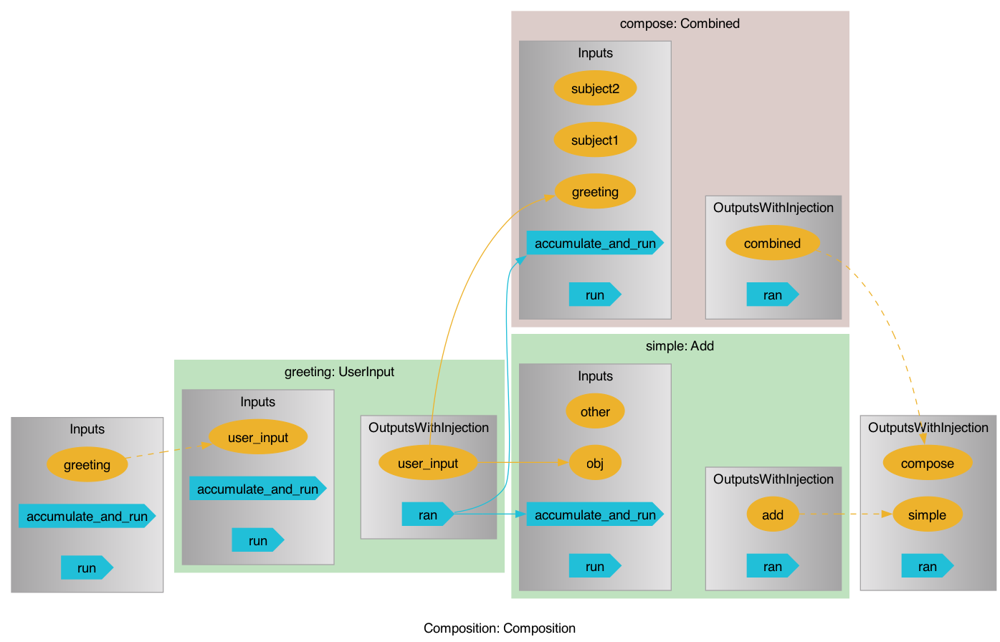

# pyiron_workflow

[](https://mybinder.org/v2/gh/pyiron/pyiron_workflow/HEAD)
[](https://opensource.org/licenses/BSD-3-Clause)
[](https://app.codacy.com/gh/pyiron/pyiron_workflow/dashboard?utm_source=gh&utm_medium=referral&utm_content=&utm_campaign=Badge_grade)
[](https://coveralls.io/github/pyiron/pyiron_workflow?branch=main)
[](https://pyiron-workflow.readthedocs.io/en/latest/?badge=latest)

[](https://anaconda.org/conda-forge/pyiron_workflow)
[](https://anaconda.org/conda-forge/pyiron_workflow)
[](https://anaconda.org/conda-forge/pyiron_workflow)
[](https://anaconda.org/conda-forge/pyiron_workflow)

## Overview

`pyiron_workflow` is a framework for constructing workflows as computational graphs from simple python functions. Its objective is to make it as easy as possible to create reliable, reusable, and sharable workflows, with a special focus on research workflows for HPC environments.

Nodes are formed from python functions with simple decorators, and the resulting nodes can have their data inputs and outputs connected. 
Unlike regular python, they operate in a delayed way.

By allowing (but not demanding, in the case of data DAGs) users to specify the execution flow, both cyclic and acyclic graphs are supported. 

By scraping type hints from decorated functions, both new data values and new graph connections are (optionally) required to conform to hints, making workflows strongly typed.

Individual node computations can be shipped off to parallel processes for scalability. Standard python executors like `concurrent.futures.ThreadPoolExecutor` and `ProcessPoolExecutor` work, but so does, e.g., the `Executor` executor from [`executorlib`](https://github.com/pyiron/executorlib), which facilitates running on HPC. It is also straightforward to run an entire graph on a remote process, e.g. a SLURM allocation, by locally saving the graph and remotely loading, running, and re-saving. Cf. [this notebook](../notebooks/hpc_example.ipynb) for some simple examples.

Once you're happy with a workflow, it can be easily turned it into a macro for use in other workflows. This allows the clean construction of increasingly complex computation graphs by composing simpler graphs.

Nodes (including macros) can be stored in plain text as python code, and imported by future workflows for easy access. This encourages and supports an ecosystem of useful nodes, so you don't need to re-invent the wheel. When these python files are in a properly managed git repository and released in a stable channel (e.g. conda-forge), they fulfill most requirements of the [FAIR](https://en.wikipedia.org/wiki/FAIR_data) principles.

Executed or partially-executed graphs can be stored to file, either by explicit call or automatically after running. These can be reloaded (automatically on instantiation, in the case of workflows) and examined/rerun, etc. If your workflow fails, it will (by default) save a recovery file for you to restore it at the time of failure.

## Installation

`conda install -c conda-forge pyiron_workflow`

## User introduction

`pyiron_workflow` offers a single-point-of-entry in the form of the `Workflow` object, and uses decorators to make it easy to turn regular python functions into "nodes" that can be put in a computation graph.

Decorating your python function as a node means that it's actually now a class, so you'll need to instantiate it before you can call it -- but otherwise it's a _lot_ like a regular python function. You can put regular python code inside it, and it that code will run whenever you run the node.

```python
>>> from pyiron_workflow import Workflow
>>>
>>> @Workflow.wrap.as_function_node
... def HelloWorld(greeting="Hello", subject="World"):
...     hello = f"{greeting} {subject}"
...     return hello
>>>
>>> hello_node = HelloWorld()  # Instantiate a node instance
>>> hello_node(greeting="Salutations")  # Use it just like a function
'Salutations World'

```

The intent of this node form is to build up a collection of function calls into a _directed graph_ that gives a formal definition of your workflow. Under the hood, the node above has labelled input and output data channels:

```python
>>> print(hello_node.inputs.labels)
['greeting', 'subject']

>>> hello_node.outputs.hello.value
'Salutations World'

```

Each time it runs, the `Function` node is taking its input, passing it to the function we decorated, executing that, and then putting the result into the node's output channels. These inputs and outputs can be chained together to form a computational graph. Inputs and outputs aren't actually just the data they hold -- they are data channels -- but you can perform most python operations on them _as though_ they were raw objects. If a node only has a single output, you can reference it directly in place of its single output channel. This dynamically creates a new node to delay the operation and handle it at runtime:

```python
>>> first = HelloWorld("Welcome", "One")
>>> second = HelloWorld("Greetings", "All")
>>> combined = first + " and " + second
>>> print(type(combined))
<class 'pyiron_workflow.nodes.standard.Add'>
>>> combined()
'Welcome One and Greetings All'

```

<aside style="background-color: #a86932; border-left: 5px solid #ccc; padding: 10px;">
Nodes couple input values to output values. In order to keep this connection truthful, it is best practice to write nodes that do not mutate mutable data, i.e. which are functional and idempotent. Otherwise, a downstream node operation may silently alter the output of some upstream node! This is python and idempotency is only a best practice, not a strict requirement; thus it's up to you to decide whether you want your nodes to mutate data or not, and to take care of side effects.
</aside>

Sets of nodes can be collected under the umbrella of a living `Workflow` object, that can have nodes add to and removed from it. Let's build the above graph as a `Workflow`, and leverage one of the built-in `standard` nodes to hold input and fork it to two different downstream nodes:

```python
>>> wf = Workflow("readme")
>>> wf.greeting = Workflow.create.standard.UserInput("Hi")
>>> wf.first = HelloWorld(greeting=wf.greeting)
>>> wf.second = HelloWorld(greeting=wf.greeting)
>>> wf.combined = wf.first + " and " + wf.second
>>> wf()
{'combined__add': 'Hi World and Hi World'}

```

Here we see that the output comes as a dictionary, with keys according to the node lable (`'combined'` and the channel name (`'add'`). Workflows return all unconnected output, and take any unconnected input as input arguments with similar keyword rules. Let's exploit this to easily re-run our workflow with different values:

```python
>>> wf(greeting__user_input="Hey", first__subject="you")
{'combined__add': 'Hey you and Hey World'}

```

Once we have a workflow we like and think is useful, we may wish to package it as a `Macro` node. These are a lot like workflow, but "crystallized". Like `Function` nodes, they have a fixed set of input and output. They also let you have a bit more control over what gets exposed as IO, unlike workflows which (by default) expose all the unconnected bits. Defining a `Macro` is also a lot like defining a `Function` -- it can be done by decorating a simple python function. However, where `Function` nodes execute their decorated function at each run and can hold arbitrary python code, `Macro` nodes decorate a function that defines the graph they hold, it is executed _once_ at instantiation, the input values are themselves all data channels and not the raw data, and from then on running the node runs that entire graph:

```python
>>> @Workflow.wrap.as_macro_node
... def Combined(wf, greeting="Hey", subject1="You", subject2="World"):
...     wf.first = HelloWorld(greeting=greeting, subject=subject1)
...     wf.second = HelloWorld(greeting=greeting, subject=subject2)
...     wf.combined = wf.first + " and " + wf.second
...     return wf.combined
>>> 
>>> hello_macro = Combined()
>>> hello_macro(subject2="everyone")
{'combined': 'Hey You and Hey everyone'}

```

Not only does this give us a bit more control with how people interface with the graph (i.e. what IO to expose, what defaults (if any) to use), but `Macro` nodes are _composable_ -- we can stick them into other macros or workflows as nodes, i.e. we can nest a sub-graph inside our graph. Let's do that, and also give a first example of a node with multiple outputs:

```python
>>> @Workflow.wrap.as_macro_node
... def Composition(self, greeting):
...     self.compose = Combined(greeting=greeting)
...     self.simple = greeting + " there"
...     return self.compose, self.simple
>>>
>>> composed = Composition()
>>> composed(greeting="Hi")
{'compose': 'Hi You and Hi World', 'simple': 'Hi there'}

```

(Note that we also renamed the first variable to python's canonical `self`. It doesn't matter what the first variable is called -- but it must be there and represents the macro instance! If it's easier to use python's `self`, go for it; if you're copying and pasting from a workflow you wrote, `wf` or whatever your workflow variable was will be easier.)

Although the macro exposes only particular data for IO, you can always dig into the object to see what's happening:

```python
>>> composed.compose.second.outputs.hello.value
'Hi World'

```

This lets us build increasingly complex workflows by composing simpler blocks. These building blocks are shareable and reusable by storing your macro in a `.py` file, or even releasing them as a python package. These workflows are formally defined, so unlike a plain python script it's easy to give them non-code representations, e.g. we can `.draw` our workflows or nodes at a high level:



Or dive in and resolving macro nodes to a specified depth:


To explore other benefits of `pyiron_workflow`, look at the `quickstart.ipynb` in the demo [notebooks](../notebooks). There we explore
- Making nodes (optionally) strongly-typed
- Saving and loading (perhaps partially) executed workflows
- Parallelizing workflow computation by assigning executors to specific nodes
- Iterating over data with for-loops

For more advanced topics, like cyclic graphs, check the `deepdive.ipynb` notebook, explore the docstrings, or look at the

## Structure

This section is targeted at readers who want to contribute to the core platform of `pyiron_workflow`, or power-users who have hit a behaviour or edge case they want to understand more deeply and need some hints where to look.

The core classes responsible for structuring workflows as a graph are `pyiron_workflow.channels.Channel` and `pyiron_workflow.node.Node` which form the edges and (unsurprisingly) nodes of the computational graph.
Each node holds multiple channels which specify how it interfaces with other nodes.

As far as possible, the different tasks and roles of a node have been decomposed, such that `pyiron_workflow.node.Node` (and to a lesser extent `pyiron_workflow.channels.Channel`) inherits individual pieces of behaviour from simpler, specialized classes.
All of these classes that are upstream of nodes (and channels) are stored in the `pyiron_workflow.mixin` sub-module.
They range from extremely simple mix-ins like `pyiron_workflow.has_interface_mixins.has_label`, which does nothing more than guarantee that child classes have `label: str` and `full_label: str` attributes, to complex mix-ins like `pyiron_workflow.run.Runnable`, which provides the capability for children to use the `run()` method, along with specifying what else needs to be implemented for this to be possible and provided other associated tools and methods.
Each of these mix-in modules has a rationale for its existence -- it's "why" -- as the module-level docstring, and provides insight into the promises the mix-in makes as class-level docstrings.
The node class brings together these individual capabilities and controls their interactions, but to understand each inherited power on its own, review these modules.

Everything(*) _downstream_ in the inheritance tree from nodes is in the `pyiron_workflow.nodes` sub-module.
Where `pyiron_workflow.mixin` defines the core capabilities of `pyiron_workflow.nodes.Node`, `pyiron_workflow.nodes` provides specialization and diversification of roles.
A key player is `pyiron_workflow.nodes.static_io.StaticNode`, which holds tools facilitating and ensuring that node IO is specified at the _class_ level -- a critical capability if we start thinking about assessing node interoperability and guided workflow design, where we don't want to need to first instantiate nodes to find out whether they'll work!
It also holds familiar user facing nodes like `pyiron_workflow.nodes.function.Function`, which makes sure each run of the node executes a particular python function, and `pyiron_workflow.nodes.macro.Macro` which inherits from the more generic `pyiron_workflow.nodes.composite.Composite` and holds its own sub-graph and executes _that_ when you run the node.
Other than `pyiron_workflow.nodes.multiple_dispatch`, which holds some helpers for making sure we can make both calls like `@as_function_node` _and_ `@as_function_node()`, the submodules here all define different node classes somewhere on the spectrum between abstract mix-in or base classes down to the user-facing, extremely specific `pyiron_workflow.nodes.standard` library of nodes to be included in user workflows!

(*) Ok, not quite _everything_ downstream from `pyiron_workflow.node.Node` is in `pyiron_workflow.nodes`.
There is also `pyiron_workflow.workflow.Workflow` -- the main entry point for users.
Unlike literally every other node, workflow objects have dynamic and variable IO and _cannot_ be inserted as part of any other workflow (i.e. they must be a parent-most object in their workflow graph).
Otherwise, they inherit from `pyiron_workflow.nodes.composite.Composite` just like macros, and behave in a similar way.
In principle the classes should be refactored so that nodes and workflows both inherit from shared capability, but that workflows are themselves not directly nodes -- i.e. pull the `pyiron_workflow.nodes.static_io.StaticNode` behaviour right up into `pyiron_workflow.node.Node`, and spin off some ur-ancestor for `pyiron_workflow.node.Node` and `pyiron_workflow.workflow.Workflow`.
There is an open issue to this effect: https://github.com/pyiron/pyiron_workflow/issues/360.

Just like nodes, there are more-specific children for `pyiron_workflow.channels.Channel`.
In general, they can be divided along two sets of axes: input/output and data/signal.
The input/output division is clear, and is just to ensure that no connections are made between, e.g., two input nodes.
Where we _do_ need to pass data from input-to-input, for instance from the outer IO layer of a "walled garden" macro down to its child nodes (cf. the user documentation for more details), we exploit the `pyiron_workflow.channels.DataChannel.value_receiver: pyiron_workflow.channel.DataChannel | None` attribute to keep two like-typed channels synchronized.
For `pyiron_workflow.channels.SignalChannel`, there is no equivalent -- these control execution flow and it is nonsensical to have a connection between two inputs or two outputs.
In fact, most of the time you won't think about signal channels at all; for directed acyclic graphs (DAGs), appropriate execution flow can be automatically determined from the structure of the data channel connections and signals channel connections are fully automated.
Direct management of signal channels only comes up for cyclic graphs or conditional execution patterns (cf. `pyiron_workflow.nodes.standard.If`).

The `pyiron_workflow.executors` sub-module holds objects to the `pyiron_workflow.node.Node.executor: concurrent.futures.Executor` attribute, and the remaining top-level modules are quite independent and can each be explored on its own.
Some are simple things we put onto nodes, like `pyiron_workflow.io` which are just containers for holding channels, or things that take a node and do something with it, like `pyiron_workflow.draw`.

Stuff that didn't fit in the narrative flow but is interesting anyhow:
- Nodes (except for workflows) are required to have a static _interface_, but what they do internally is free to change! A simple example is to think of a function node, which might return `True` under some input conditions, or `False` under others. A more complex example that is worth examining is the `pyiron_workflow.nodes.for_loop.For` node. It is composite and executes its subgraph, but at each run it internally modifies its children in order to accommodate for the length of input it is given! This is bold, but perfectly permissible since the IO channels for the for-node stay the same throughout.
- The main user-interface for `pyiron_workflow` is `pyiron_workflow.Workflow`, but there are other tools available in `pyiron_workflow.__init__` that specify the full API and may be useful to power-users and node developers; changes that don't impact the interface or behaviour of the publicly available tools there are free from the constraints of semantic versioning, but if a change touches anything listed there we should aim for backwards compatibility.
